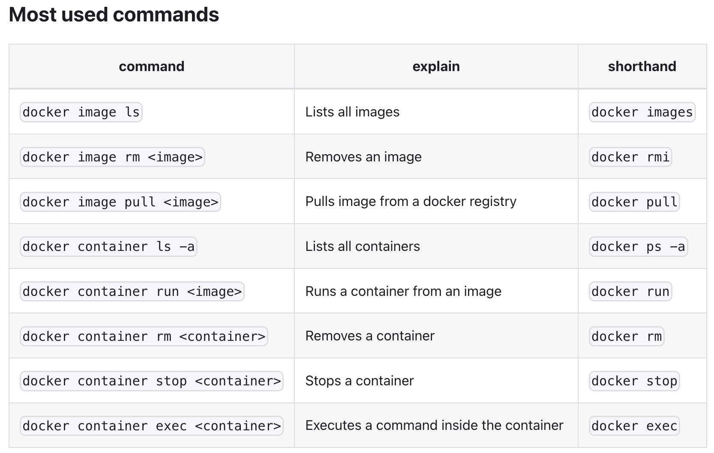

# DevOps with Docker

## DevOps

DevOps means the release, configuring and monitoring of software is in the hands of the very people who develop it.

## Images and containers

Containers are instances of images.

## Most used commands

